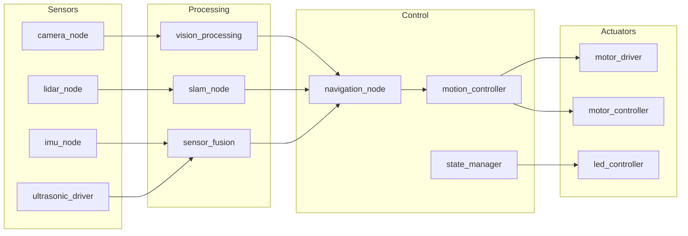
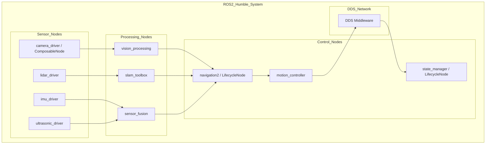
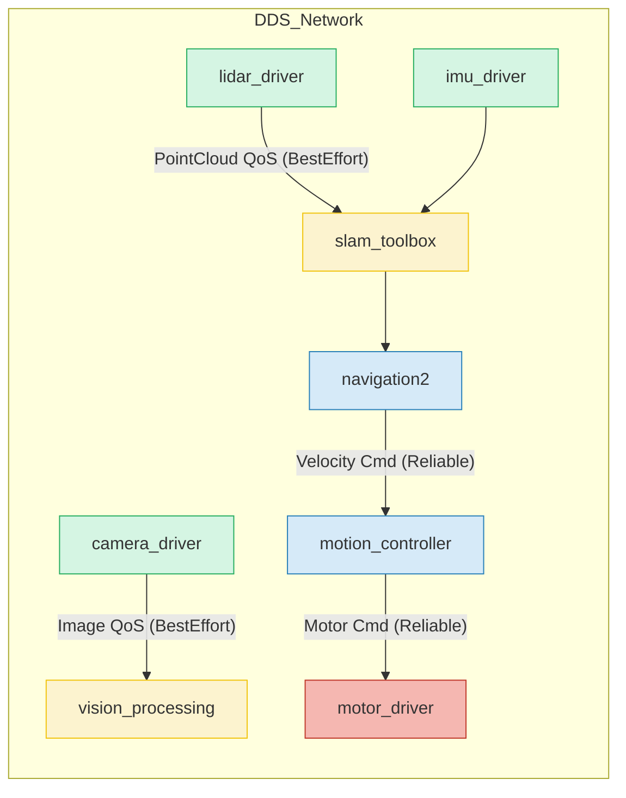

# ViroFighter: System Architecture Documentation

## Current ROS1 Melodic Architecture

### System Overview
The ViroFighter robot operates on ROS1 Melodic with a modular architecture designed for real-time navigation and control.

### ROS1 Melodic Node Graph (Current Data Flow)


### Core Components

#### 1. Sensor Layer
| Node | Package | Purpose | Message Types |
|------|---------|---------|---------------|
| `camera_driver` | `virofighter_vision` | RGB/Depth image capture | `sensor_msgs/Image`, `sensor_msgs/CameraInfo` |
| `lidar_driver` | `virofighter_lidar` | 2D/3D point cloud data | `sensor_msgs/PointCloud2` |
| `imu_driver` | `virofighter_imu` | Orientation and acceleration | `sensor_msgs/Imu` |
| `ultrasonic_driver` | `virofighter_sensors` | Distance measurement | `sensor_msgs/Range` |

#### 2. Processing Layer
| Node | Package | Purpose | Input/Output |
|------|---------|---------|--------------|
| `vision_processing` | `virofighter_vision` | Object detection and tracking | Image → `vision_msgs/DetectionArray` |
| `slam_node` | `virofighter_slam` | Simultaneous Localization and Mapping | PointCloud2 + Imu → `nav_msgs/Odometry` |
| `sensor_fusion` | `virofighter_fusion` | Multi-sensor data fusion | Multiple sensors → `geometry_msgs/PoseWithCovariance` |

#### 3. Control Layer
| Node | Package | Purpose | Services/Actions |
|------|---------|---------|------------------|
| `navigation_node` | `virofighter_navigation` | Path planning and execution | `nav_msgs/GetPlan`, `move_base_msgs/MoveBaseAction` |
| `motion_controller` | `virofighter_control` | Motor and servo control | `virofighter_msgs/SetVelocity`, `virofighter_msgs/SetPose` |
| `state_manager` | `virofighter_core` | System state management | `std_srvs/SetBool`, `virofighter_msgs/GetStatus` |

#### 4. Actuator Layer
| Node | Package | Purpose | Commands |
|------|---------|---------|----------|
| `motor_driver` | `virofighter_motors` | DC motor control | `geometry_msgs/Twist` |
| `servo_controller` | `virofighter_servos` | Servo motor control | `std_msgs/Float64` |
| `led_controller` | `virofighter_utils` | LED status indicators | `std_msgs/ColorRGBA` |

### Key Communication Topics

#### Critical Topics
- `/virofighter/odometry` (nav_msgs/Odometry) - Current position and velocity
- `/virofighter/cmd_vel` (geometry_msgs/Twist) - Velocity commands
- `/camera/rgb/image_raw` (sensor_msgs/Image) - Camera feed
- `/scan` (sensor_msgs/LaserScan) - LiDAR data

#### Custom Messages
- `virofighter_msgs/SystemStatus.msg` - Robot health monitoring
- `virofighter_msgs/MotorCommand.msg` - Detailed motor control
- `virofighter_msgs/DetectionResult.msg` - Vision processing results

## Target ROS2 Humble Architecture

### ROS2 Humble Node Graph (Target Architecture)


### Planned Improvements
1. **Decentralized Discovery**: Remove single-point failure with DDS
2. **Quality of Service (QoS)**: Implement reliable communication for critical topics
3. **Lifecycle Nodes**: Proper state management for all nodes
4. **Component Nodes**: Modular architecture for better resource management

### ROS2 Node Structure
```python
# Example ROS2 component structure
LaunchDescription([
    ComposableNode(
        package='virofighter_vision',
        plugin='virofighter::CameraDriver',
        name='camera_driver'
    ),
    ComposableNode(
        package='virofighter_navigation',
        plugin='virofighter::NavigationNode',
        name='navigation_node'
    )
])
```
## QoS Configuration

| **Topic Type**   | **Reliability** | **Durability**     | **Deadline** |
|------------------|-----------------|--------------------|---------------|
| Command topics   | RELIABLE - Ensures all commands are delivered| VOLATILE - Commands don't need to persist| 100 ms - Strict timing requirements for control|
| Sensor data      | BEST_EFFORT - Some data loss acceptable for throughput| VOLATILE - Real-time data, no persistence needed| N/A - Variable rates based on sensor capabilities|
| System status    | RELIABLE - Critical system information must be delivered| TRANSIENT_LOCAL - New nodes can receive last known status| 1 s - Regular status updates required|

---

## Migration Impact Analysis

### High Impact Components
- **Navigation Stack:** Requires complete rewrite for ROS2 `navigation2`
- **Vision Pipeline:** `cv_bridge` and `vision_msgs` API changes
- **Custom Messages:** Need regeneration with the new ROS2 build system

### Medium Impact Components
- **Driver Nodes:** Require updated parameter handling and lifecycle management
- **Control Algorithms:** APIs need updating, but logic remains largely unchanged

### Low Impact Components
- **Utility Nodes:** Simple publishers/subscribers with minimal modification
- **Data Logging:** Only minor changes required for ROS2 compatibility

---

## Dependencies Mapping

### Third-party Packages

| **ROS1 Package** | **ROS2 Equivalent** | **Migration Strategy**          |
|------------------|---------------------|---------------------------------|
| `move_base`      | `nav2`              | Major rewrite required          |
| `amcl`           | `nav2_amcl`         | Configuration changes           |
| `gmapping`       | `slam_toolbox`      | Algorithm adaptation            |
| `opencv_apps`    | `vision_opencv`     | API updates                     |

## Migration Flow Overview


## Dependency Migration Details

### Navigation Stack
**`move_base → nav2`**

- Complete architecture change requiring:
  - Behavior tree implementation  
  - New plugin system  
  - Different parameter structure  

---

### Localization
**`amcl → nav2_amcl`**

- Similar algorithm, different configuration  
- Parameter migration required  
- New launch file structure  

---

### SLAM
**`gmapping → slam_toolbox`**

- Different algorithm with improved performance  
- Configuration parameter changes  
- New API for map management  

---

### Vision
**`opencv_apps → vision_opencv`**

- API compatibility mostly maintained  
- Some deprecated functions replaced  
- Build system updates required  

---

## Risk Assessment

### High-Risk Items
- **Navigation stack compatibility:** Complex logic migration required  
- **Real-time performance:** DDS configuration tuning may be needed  
- **Third-party dependency availability:** Some packages may lack ROS2 equivalents  

---

### Mitigation Strategies
- Utilize **`ros1_bridge`** for incremental testing and validation  
- Conduct **early performance benchmarking** to identify bottlenecks  
- **Identify and evaluate alternative packages** early in the process 

## Communication Architecture
### DDS and QoS Integration

